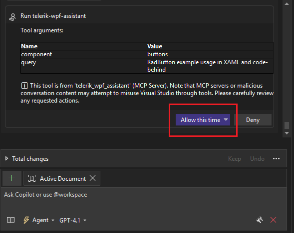

# Telerik WPF MCP Server

The Telerik WPF [MCP (Model Context Protocol) Server](https://modelcontextprotocol.io/introduction) enhances your AI-powered development experience by providing specialized context about Telerik UI for WPF components.

This MCP server enables AI-powered IDEs and tools to generate more accurate, tailored code that leverages [Telerik UI for WPF components](https://www.telerik.com/WPF-ui) and APIs. You can ask complex questions about Telerik components, request specific implementations, and generate comprehensive code solutions.

## Prerequisites

To use the Telerik WPF MCP server, you need:

* [Node.js](https://nodejs.org/en) 18 or newer.
* An [MCP-compatible client](https://modelcontextprotocol.io/clients) that supports **MCP tools** (latest version recommended).

@[template](/_contentTemplates/ai-coding-assistant.md#getting-started)

## Server Installation

Install the Telerik WPF MCP server using npm:

```bash
npm i @progress/telerik-wpf-mcp
```

### Server Configuration

Use these settings when configuring the server in your MCP client:

| Setting | Value |
|---------|-------|
| Package Name | `@progress/telerik-wpf-mcp` |
| Type | `stdio` (standard input/output transport) |
| Command | `npx` |
| Arguments | `-y` |
| Server Name | `telerikWpfAssistant` (customizable) |

### License Configuration

Add your [Telerik license key]() as an environment parameter in your `mcp.json` file using one of these options:

__Option 1: License File Path (Recommended)__

 ```json
 "env": {
     "TELERIK_LICENSE_PATH": "THE_PATH_TO_YOUR_LICENSE_FILE"
 }
 ```
 
The `THE_PATH_TO_YOUR_LICENSE_FILE` should point to the `telerik-license.txt` file, which is usually located in the AppData folder. 
So, the field often will look like this: `"TELERIK_LICENSE_PATH": "%appdata%/Telerik/telerik-license.txt"`

__Option 2: Direct License Key__

 ```json
 "env": {
     "TELERIK_LICENSE": "YOUR_LICENSE_KEY_HERE"
 }
 ```

> Option 1 is recommended unless you're sharing settings across different systems. Remember to [update your license key](#updating-your-license-key) when necessary.

## Visual Studio Installation

For complete setup instructions, see [Use MCP servers in Visual Studio](https://learn.microsoft.com/en-us/visualstudio/ide/mcp-servers).

> Early Visual Studio 17.14 versions require the Copilot Chat window to be open when opening a solution for the MCP server to work properly.

### Workspace-Specific Setup:

1. Add `.mcp.json` to your solution folder.

 ```json
 {
   "inputs": [],
   "servers": {
     "telerik-wpf-assistant": {
       "type": "stdio",
       "command": "npx",
       "args": ["-y", "@progress/telerik-wpf-mcp@latest"],
       "env": {
         "TELERIK_LICENSE_PATH": "THE_PATH_TO_YOUR_LICENSE_FILE",
         // or
         "TELERIK_LICENSE": "YOUR_LICENSE_KEY"
       }
     }
   }
 }
 ```

2. Restart Visual Studio.
3. Enable the `telerik-wpf-assistant` tool in the [Copilot Chat window's tool selection dropdown](https://learn.microsoft.com/en-us/visualstudio/ide/mcp-servers?view=vs-2022#configuration-example-with-github-mcp-server).

	

### Global Setup:

To enable the server globally for all projects, add the `.mcp.json` file to your user directory (`%USERPROFILE%`, e.g., `C:\Users\YourName\.mcp.json`).

## Usage

To use the Telerik MCP Server:

1. Start your prompt with one of these triggers:
   - `/telerik` / `@telerik` / `#telerik`
   - `/telerikwpf` / `@telerikwpf` / `#telerikwpf`
   - `#telerik-wpf-assistant`
   
1. Grant permissions when prompted (per session, workspace, or always).

	

1. Start fresh sessions for unrelated prompts to avoid context pollution.

You can check the Output pane of Visual Studio for diagnostics information related to Copilot. To display the relevant information, select to show output from GitHub Copilot.


### Improving Server Usage

To increase the likelihood of the Telerik MCP server being used, add custom instructions to your AI tool:
- [GitHub Copilot custom instructions](https://docs.github.com/en/copilot/customizing-copilot/adding-repository-custom-instructions-for-github-copilot#about-repository-custom-instructions-for-github-copilot-chat)

### Sample Prompts

The following examples demonstrate useful prompts for the Telerik WPF MCP Server:

* "`/telerik` Give me an example of binding an ObservableCollection<Customer> to a RadGridView, including sorting and grouping."
* "`/telerikWPF` Create a RadComboBox bound to a list of countries in MVVM, displaying country names but binding the SelectedValue to a CountryCode property."
* "`/telerik` Show XAML and ViewModel code for a RadTreeView bound to a hierarchical ObservableCollection<Category> where each category contains products. Expand all categories by default."

## Number of Requests

@[template](/_contentTemplates/ai-coding-assistant.md#number-of-requests)

## Local AI Model Integration

You can use the Telerik WPF MCP server with local large language models (LLMs):

1. Run a local model, for example, through [Ollama](https://ollama.com).
2. Use a bridge package like [MCP-LLM Bridge](https://github.com/patruff/ollama-mcp-bridge).
3. Connect your local model to the Telerik MCP server.

This setup allows you to use the Telerik AI Coding Assistant without cloud-based AI models.

## See Also

* [Telerik WPF GitHub Copilot Extension]()
* [AI Coding Assistant Overview]()
