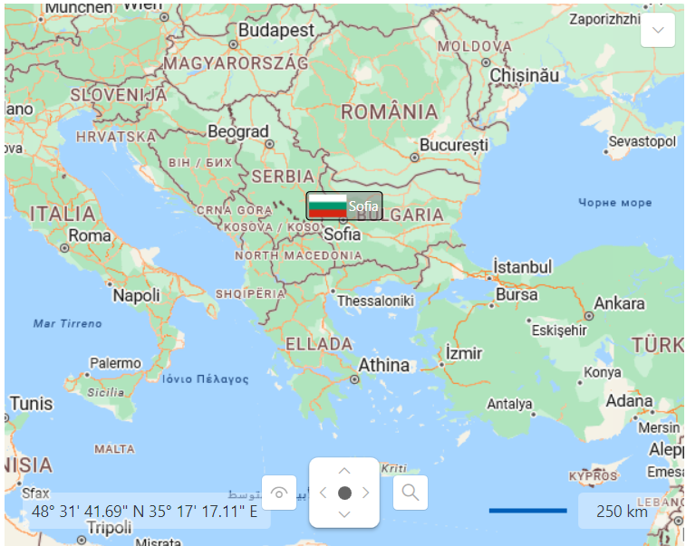

# Pin Points

The __MapPinPoint__ class is designed to represent __Point__ objects from __KML__ files. However, it can be also used outside the __KML__ context in order to mark points of interest (POIs) or something else.      

## Adding a MapPinPoint

To insert a pin point on your map you have to add a __MapPinPoint__ object to your __InformationLayer__.        

>tip To learn more about the __Information Layer__ read [here]().          

Here is an example:


```XAML
	<telerik:RadMap x:Name="radMap"
	                Width="600"
	                Height="480">
	    <telerik:InformationLayer>
	        <telerik:MapPinPoint>
	        </telerik:MapPinPoint>
	    </telerik:InformationLayer>
	</telerik:RadMap>
```

## Configuring the MapPinPoint

In order to configure the position of the __MapPinPoint__ you have to set the __Location__ attached property of the __MapLayer__ class. Here is an example:        


```XAML
	<telerik:RadMap x:Name="radMap"
	                Width="600"
	                Height="480">
	    <telerik:InformationLayer>
	        <telerik:MapPinPoint telerik:MapLayer.Location="42.6957539183824, 23.3327663758679">
	        </telerik:MapPinPoint>
	    </telerik:InformationLayer>
	</telerik:RadMap>
```

In order to position the pin point more precisely you can use the __MapLayer.HotSpot__ attached property. Here is an example.        

>tip To learn more about the __HotSpot__ functionality read [here]().          


```XAML
	<telerik:RadMap x:Name="radMap"
	                Width="600"
	                Height="480">
	    <telerik:InformationLayer>
	        <telerik:MapPinPoint telerik:MapLayer.Location="42.6957539183824, 23.3327663758679">
	            <telerik:MapLayer.HotSpot>
	                <telerik:HotSpot X="0.5"
	                                    Y="1" />
	            </telerik:MapLayer.HotSpot>
	        </telerik:MapPinPoint>
	    </telerik:InformationLayer>
	</telerik:RadMap>
```

With these values defined, the __MapPinPoint__ will be placed above the location and will be centered towards it.        

## Setting MapPinPoint's Content

By default the __MapPinPoint__ exposes two properties that allow you to set its content. The __Text__ property allows you to specify a string for the __MapPinPoint__ and the __ImageSource__ allows you to specify an image to display.       

Here is an example:


```XAML
	<telerik:RadMap x:Name="radMap"
	                Width="600"
	                Height="480">
	    <telerik:InformationLayer>
	        <telerik:MapPinPoint telerik:MapLayer.Location="42.6957539183824, 23.3327663758679"
	                                Text="Sofia"
	                                ImageSource="/Resources/Images/flag_bg.png">
	            <telerik:MapLayer.HotSpot>
	                <telerik:HotSpot X="0.5"
	                                    Y="0" />
	            </telerik:MapLayer.HotSpot>
	        </telerik:MapPinPoint>
	    </telerik:InformationLayer>
	</telerik:RadMap>
```

Here is a snapshot of the result:


## Modifying the MapPinPoint's appearance

As you can see in the previous section the __MapPinPoint__ doesn't look very good. In order to boost its appearance you can use the standard properties:        

* __Background__

* __Foreground__

* __BorderBrush__

* __BorderThickness__

Here is an example:


```XAML
	<telerik:RadMap x:Name="radMap"
	                Width="600"
	                Height="480">
	    <telerik:InformationLayer>
	        <telerik:MapPinPoint telerik:MapLayer.Location="42.6957539183824, 23.3327663758679"
	                                Background="#80808080"
	                                Foreground="White"
	                                BorderBrush="Black"
	                                BorderThickness="1"
	                                Text="Sofia"
	                                ImageSource="/Resources/Images/flag_bg.png">
	            <telerik:MapLayer.HotSpot>
	                <telerik:HotSpot X="0.5"
	                                    Y="1" />
	            </telerik:MapLayer.HotSpot>
	        </telerik:MapPinPoint>
	    </telerik:InformationLayer>
	</telerik:RadMap>
```

Here is a snapshot of the final result:



## See Also
 * [Information Layer]()
 * [Framework Elements]()
 * [Map Shapes]()
 * [Hot Spots]()