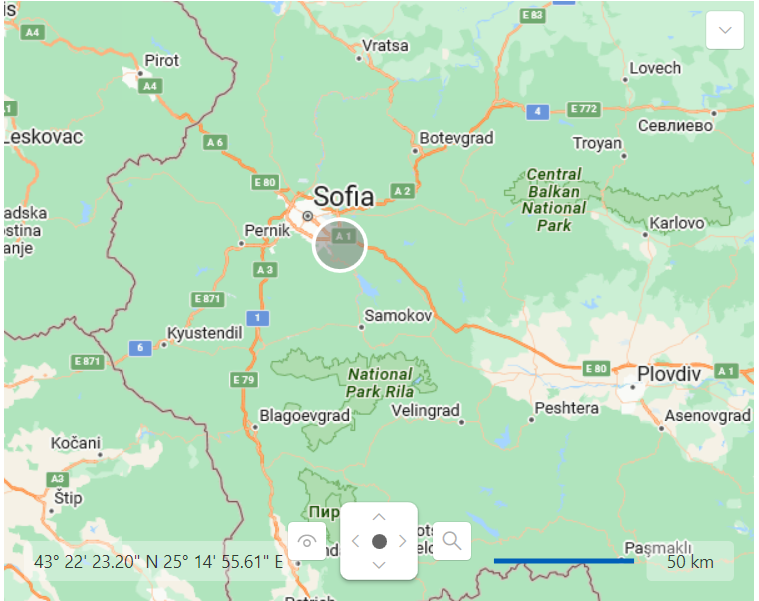
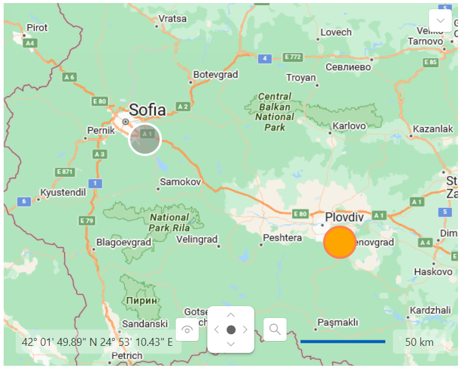

# Shape Appearance

When using __MapShape__ objects there are several ways to control their appearance:

* [Using the trivial properties](#using-the-trivial-properties)

* [Using the MapShapeFill object on the control level](#using-the-mapshapefill-object-on-the-control-level)

* [Using the MapShapeFill object on the layer level](#using-the-mapshapefill-object-on-the-layer-level)

>tip Another way to define the appearance of the shapes inside a layer is to use the [Colorizer]() property of the InformationLayer.

>tip To learn more about the usage of shapes read the [Map Shapes]() topic. The [KML Data Import]() and the [Shapefiles Support]() topics might also be helpful to you.

## Using the trivial properties

In this approach you use the trivial properties provided by the framework such as __Fill__, __Stroke__, __StrokeThickness__.        

Here is an example:       

#### __XAML__
```XAML
	<telerik:RadMap x:Name="radMap">
	    <telerik:InformationLayer x:Name="informationLayer">
	        <telerik:MapEllipse x:Name="Ellipse"
	                            telerik:MapLayer.Location="42.6957539183824, 23.3327663758679"
	                            Width="20"
	                            Height="20"
	                            Fill="#80808080"
	                            Stroke="White"
	                            StrokeThickness="3">
	        </telerik:MapEllipse>
	    </telerik:InformationLayer>
	</telerik:RadMap>
```

Here is a snapshot of the result:



## Using the MapShapeFill object on the control level

The __MapShape__ objects expose two specific properties - __ShapeFill__ and __HightlightFill__. The first one is applied to the shapes, when they are in their normal state. The __HighlightFill__ gets applied when the mouse is over the shape.

The two properties are of  type __MapShapeFill__. The __MapShapeFill__ object allows you not only to specify the Fill color, but to modify the stroke as well. Here is an example.

>These properties will take precedence over the trivial ones.

#### __XAML__
```XAML
	<telerik:RadMap x:Name="radMap">
	    <telerik:InformationLayer x:Name="informationLayer">
	        <telerik:MapEllipse x:Name="Ellipse"
	                            telerik:MapLayer.Location="42.6957539183824, 23.3327663758679"
	                            Width="20"
	                            Height="20">
	            <telerik:MapEllipse.ShapeFill>
	                <telerik:MapShapeFill Fill="#80808080"
	                                        Stroke="White"
	                                        StrokeThickness="3" />
	            </telerik:MapEllipse.ShapeFill>
	            <telerik:MapEllipse.HighlightFill>
	                <telerik:MapShapeFill Fill="Orange"
	                                        Stroke="Coral"
	                                        StrokeThickness="3" />
	            </telerik:MapEllipse.HighlightFill>
	        </telerik:MapEllipse>
	    </telerik:InformationLayer>
	</telerik:RadMap>
```

Here is a snapshot of the result:


## Using the MapShapeFill object on the layer level

You are also able to define the appearance of the shapes on the Information Layer level. This way every shape, that doesn't have its respective properties explicitly set, will inherit the appearance specified for the layer. For this purpose use the __ShapeFill__ and __HighlightFill__ properties of the __InformationLayer__ class. The first one is applied to the shapes, when they are in their normal state. The __HighlightFill__ gets applied when the mouse is over the shape.

>These properties will __not__ take precedence over the properties set on the control level.

<!-- -->
>These values will get applied also on shapes that are created from [KML]() and [Shapefile]() data and doesn't have their appearance explicitly set.

The two properties are of __MapShapeFill__ type. The __MapShapeFill__ object allows you not only to specify the fill color, but to modify the stroke as well. Here is an example:

#### __XAML__
```XAML
	<telerik:RadMap x:Name="radMap">
	    <telerik:InformationLayer x:Name="informationLayer">
	        <telerik:InformationLayer.ShapeFill>
	            <telerik:MapShapeFill Fill="#80808080"
	                                    Stroke="White"
	                                    StrokeThickness="3" />
	        </telerik:InformationLayer.ShapeFill>
	        <telerik:InformationLayer.HighlightFill>
	            <telerik:MapShapeFill Fill="Orange"
	                                    Stroke="Coral"
	                                    StrokeThickness="3" />
	        </telerik:InformationLayer.HighlightFill>
	        <telerik:MapEllipse telerik:MapLayer.Location="42.6957539183824, 23.3327663758679"
	                            Width="20"
	                            Height="20">
	        </telerik:MapEllipse>
	        <telerik:MapEllipse telerik:MapLayer.Location="42.1429369264591, 24.7498095849434"
	                            Width="20"
	                            Height="20">
	        </telerik:MapEllipse>
	    </telerik:InformationLayer>
	</telerik:RadMap>
```

Here is a snapshot of the result:



## See Also
 * [Colorizer]()
 * [Shape Reader]()
 * [Extended Data]()