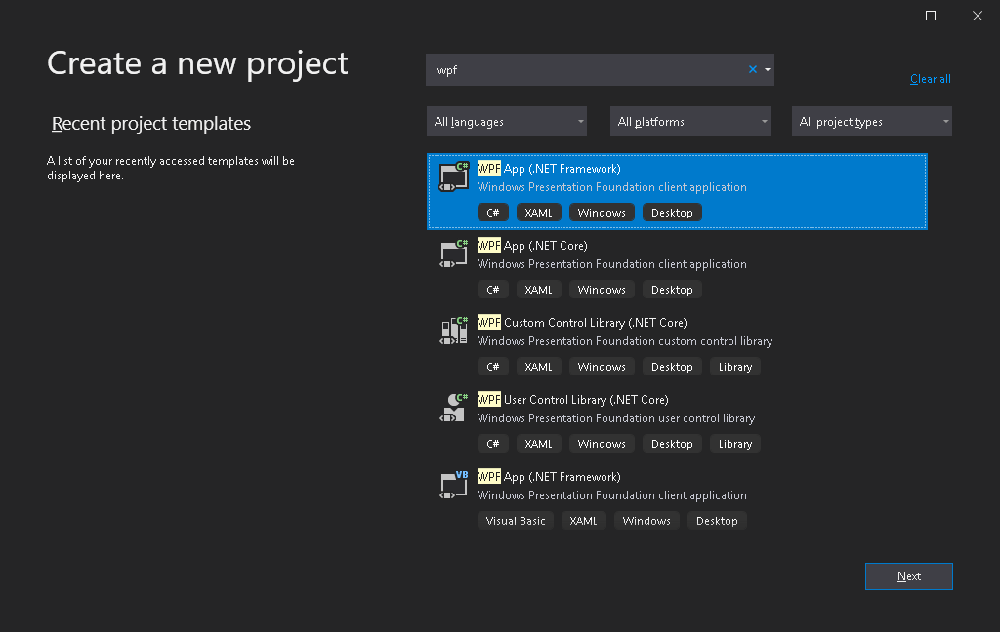
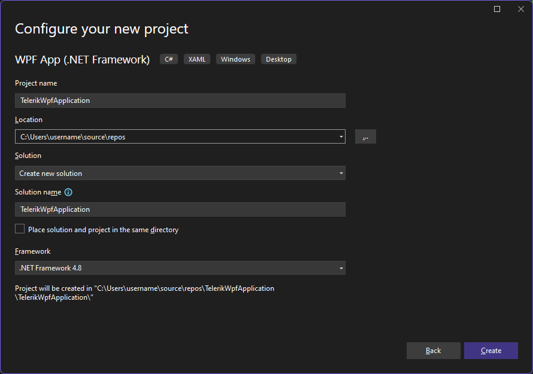
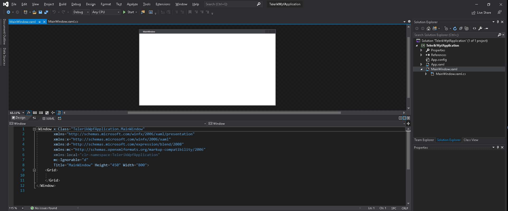
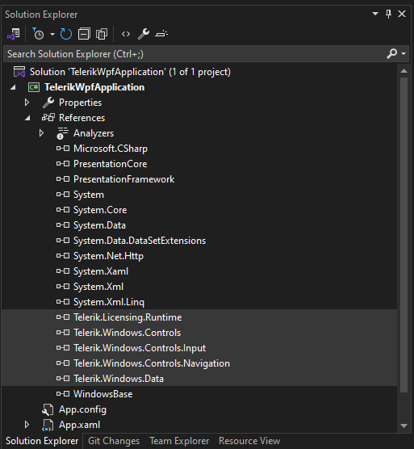

# Installing UI for WPF Using MSI File

The following topic describes what steps you should perform in order to install Telerik UI for WPF using the __MSI__ installer file. 

> Note that the recommended installation approach is to use the [Telerik NuGet packages]()

The [MSI](http://en.wikipedia.org/wiki/Windows_Installer) files are intended for easy and automatic installation of a product. The MSI installs the suite on your computer to a folder named __Progress__ in your Program Files, automatically creating the necessary virtual folders and projects.

The MSI installation __will not overwrite__ previous Telerik UI for WPF installations, unless it is of the same version.

## Downloading MSI Package

Open the [Telerik UI for WPF download page](https://www.telerik.com/account/product-download?product=RCWPF) and download the `Telerik_UI_for_WPF_[version]_[license].msi` file. Run the MSI installer and follow the instructions.

## Installing UI for WPF

1. Run the .msi installer to see the welcome window.

	

1. Check the License Agreement and click __I Agree - Continue__ button.

1. The next dialog gives you the ability to choose the setup type that best suits your needs. You can either install all Telerik Components or choose which features to install. 

	

	Choose the __Customize__ option, if you want to customize the selection of the features that will be installed.

	

1. Change the installation location or leave it as it is. The default location is `C:\Program Files (x86)\Progress\` and click __OK__.	

1. Click __Install__ to start the installation process.

	

	The installation process may take several minutes to complete.

1. After the successful installation of all features you are ready to start developing powerful and interactive applications using __Telerik UI for WPF__.

	

## Installation Folder Contents

If you open the installation folder - `C:\Program Files (x86)\Progress\Telerik UI for WPF [version]` - you will see the following folders:

* __Binaries__: The standard binaries.

* __Binaries.NoXaml__: Binaries without XAML.

* __LicenseAgreements__

* __Themes.Implicit__: Implicit styles friendly XAML.          

* __VSExtensions__

## Using the Telerik dlls in a WPF Project

To use the Telerik dlls, create a new WPF project using the Visual Studio project template from the __File --> New --> Project__ menu. 

Set a __Project name__ and __Location__ for the project. For this example, we will use `TelerikWPFApplication` for the project's name.

This will create an empty WPF project where you can reference the Telerik dlls.

### Referencing Telerik Assemblies

Use the Visual Studio's Reference Manager to browse and reference the Telerik dlls. 

If you need to set a [Telerik theme]() different than the default one check the [Xaml vs. NoXaml]() and the [Setting a Theme]() articles.

### Installing a License Key

To use the Telerik WPF product you will need to install a valid license key. Otherwise, you will see warning messages and banners related to the licensing. See how to activate a license in the [Installing License Key]() article.

### Adding Telerik Controls

After you create the WPF project and reference the Telerik assemblies, add any UI and related code-behind, models, and styles. This example will show a fundamental setup, including a RadTabControl with few tabs defined in XAML.

#### __[XAML] Adding Telerik control in the UI__
{{region installation-installing-from-zip-0}}
	<Window x:Class="TelerikWpfApplication.MainWindow"
		xmlns="http://schemas.microsoft.com/winfx/2006/xaml/presentation"
		xmlns:x="http://schemas.microsoft.com/winfx/2006/xaml"
		xmlns:d="http://schemas.microsoft.com/expression/blend/2008"
		xmlns:mc="http://schemas.openxmlformats.org/markup-compatibility/2006"
		xmlns:local="clr-namespace:TelerikWpfApplication" xmlns:telerik="http://schemas.telerik.com/2008/xaml/presentation"
		mc:Ignorable="d"
		Title="MainWindow" Height="450" Width="800">
		<Grid>
			<telerik:RadTabControl>
				<telerik:RadTabItem Header="Home" />
				<telerik:RadTabItem Header="Insert" />
				<telerik:RadTabItem Header="View" />
			</telerik:RadTabControl>
		</Grid>
	</Window>
{{endregion}}

### Deploying the Application

To deploy a WPF application, you can use several different approaches, like XCopy, ClickOnce, or Windows Installer deployment. Read more about this in the [Deploy a WPF Application](https://docs.microsoft.com/en-us/dotnet/desktop/wpf/app-development/deploying-a-wpf-application-wpf?view=netframeworkdesktop-4.8) MSDN article. 

### Redistributing Telerik Application

Several rules should be kept in mind when redistributing an application with Telerik dlls. Read more about this in the [Redistributing Telerik Assemblies]() article.

### Upgrading the Project

To upgrade the project, download the new version of the .msi or the .zip file and install it accordingly. Then remove the old Telerik references from the WPF project and [include the new ones](#referencing-telerik-assemblies). At this point, double-check if all the Telerik assemblies have the same version (for example, 2020.3.102) and if all or of the same type ([Xaml or NoXaml]()). To check this, right-click the .dll file (for example, Telerik.Windows.Controls.dll) and choose the __Properties__ option. 

Delete the __bin__ and __obj__ folders of the projects that reference Telerik dlls in the solution and then __Clean__, and __Rebuild__ them. This will ensure that no older Telerik dlls are cached and used during the compilation.

## See Also  
* [System Requirements]()
* [Download Product Files]()
* [Installing WPF Demos Application]()