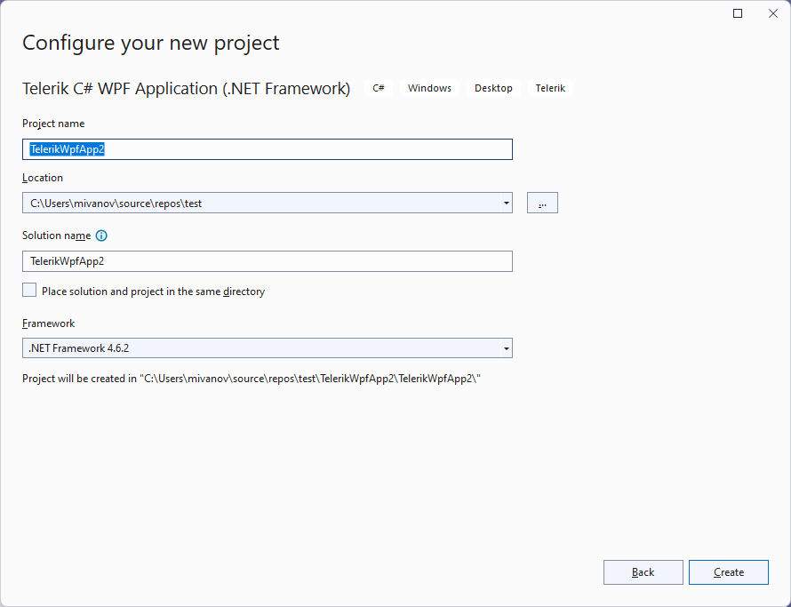
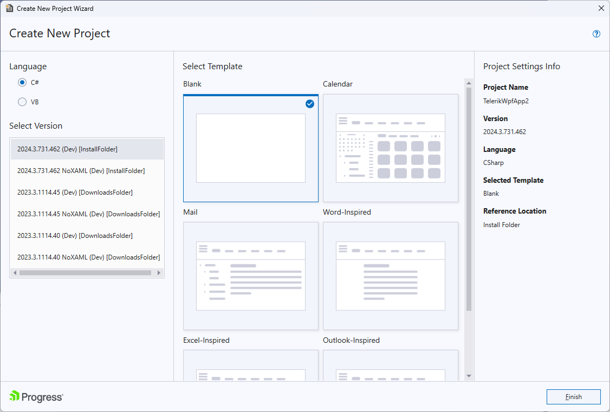
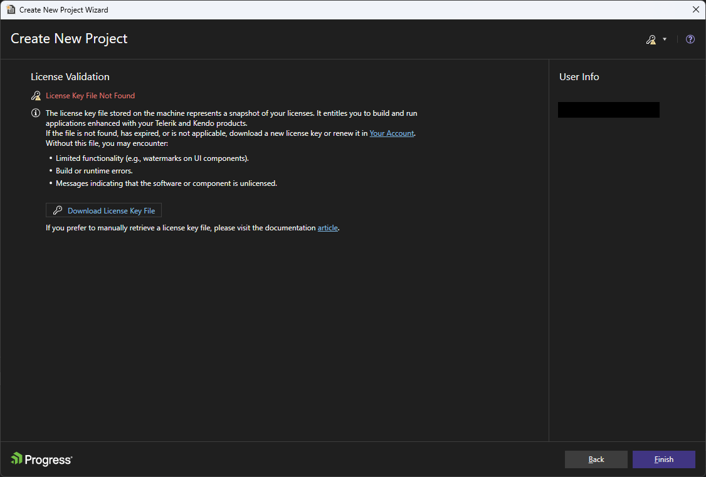
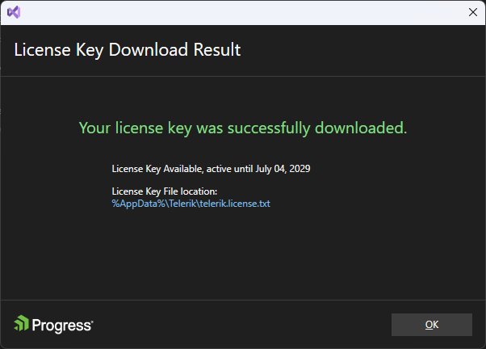
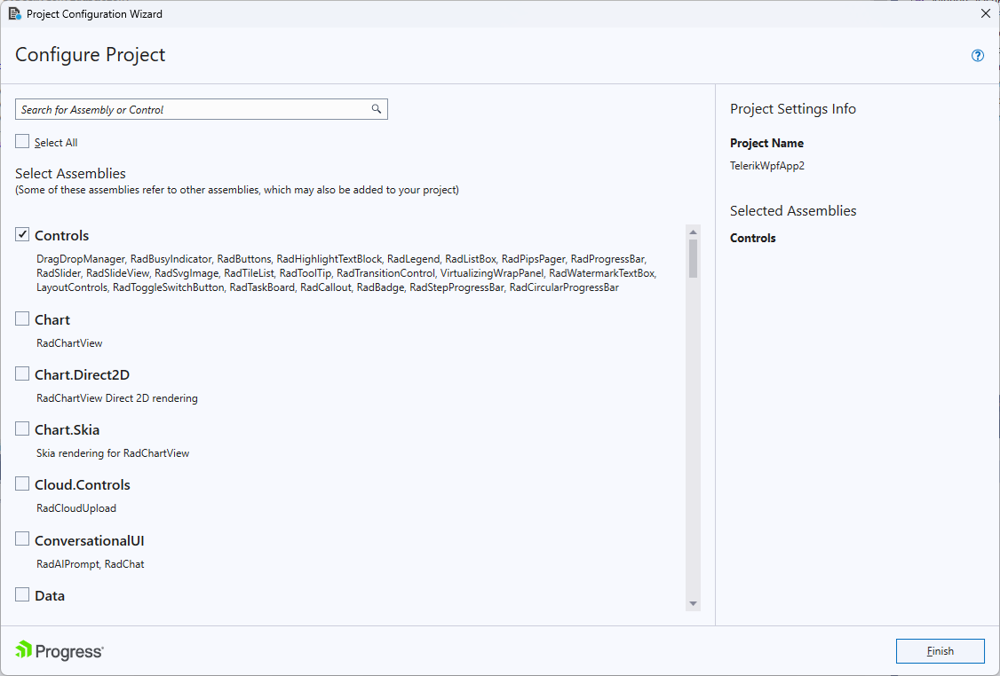
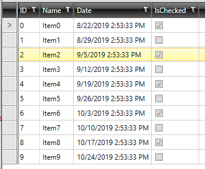

# Telerik UI for WPF First Steps with Visual Studio Extensions

This article explains how to get the Telerik UI for WPF controls in your project and start using them quickly. The topic shows what is the lifecycle when using the Telerik Visual Studio Extension.

> Note that the recommended installation approach is to use the [Telerik NuGet packages]()

## Downloading the Extension

To download the Telerik Visual Studio Extenion, you can either download the `.msi` installer from the Telerik UI for WPF [download page](https://www.telerik.com/account/product-download?product=RCWPF) or use the __Extensions__ menu of Visual Studio to download the extension from the marketplace (*"Progress Telerik UI for WPF Extension"*).

__Download automated (.msi) installer__  

If you are not a customer, you can [download a free, fully functional trial](https://www.telerik.com/try/ui-for-wpf) and the same options will apply to you as well.

The following article can help you choose the installation type that is most suitable for your needs and preferences: [Installation Approaches]().

## Creating Application with Telerik Visual Studio Extensions

The easiest way to create a Telerik UI for WPF project is to use **Visual Studio Extensions** which are distributed with the Telerik UI for WPF installer.

The Visual Studio Extensions can be accessed through the Extensions | Telerik | Telerik UI for WPF menu which has different menu items depending on the selected project in Visual Studio. The extensions can be accessed through the context menu of a WPF Application as well.

1. Open [Microsoft Visual Studio]().

2. Create new Telerik WPF application.

	__Go to Telerik > Telerik  UI for WPF > Create New Telerik Project__  
	
	
	
	__Creating new Telerik application__  
	
	

3. Choose the project template and the corresponding settings. For an empty project without any Telerik controls added to the view, choose the Blank option.
	
	__Choosing an application template__  
	
	

	At this point the project references only the common `Telerik.Windows.Controls.dll` and `Telerik.Licensing.Runtime.dll`, and you can start adding controls in the UI. 

4. In case you haven't installed a [license key]() already, you can download one using the License Validation screen.
	
	__License validation screen (license not found)__  
	
	
	
	__License validation screen (successfully downloaded a license)__
	
	

	If you have a license key already installed the License Validation screen will be skipped.

You can further configure the project using the Project Configuration Wizard. You can do that by going to the __Extensions > Telerik > Telerik UI for WPF > Configure Project__ menu in Visual Studio. When you open the wizard you can select the controls you are going to use from the list (or search them in the search box). Once you have selected them, click Finish. This will add the required dlls and references to your project.

__Adding references to the charting controls__  
	
	

This step is optional and you will only need it if you use controls that are not defined in `Telerik.Windows.Controls.dll`.

## Add a Telerik Control to the Project

For this example we will use [RadGridView]().

### Assembly References

In order to use the __RadGridView__ control in your projects, you have to add references to the following assemblies:			

* __Telerik.Windows.Controls__
* __Telerik.Windows.Controls.GridView__
* __Telerik.Windows.Controls.Input__
* __Telerik.Windows.Data__

### Adding a Telerik Control to the Project

You can add __RadGridView__ manually by writing the XAML code in __Example 1__ or you can also add the control by dragging it from the Visual Studio Toolbox and dropping it over the XAML view.
	
#### __[XAML] Adding RadGridView in XAML__
{{region xaml-gridview-getting-started2_0}}
	<telerik:RadGridView />
{{endregion}}

If you run the application, you will see an empty grid with no columns and rows as demonstrated in __Figure 6__. 

__The empty grid generated by the code in Example 1__  

### Populating with Data

In order to populate the __RadGridView__ control with data, you should create a collection of business objects. Create a new class named __Profile__ and add several different type properties to it, as shown in __Example 2__.

#### __[C#] Simple business class__  
{{region cs-gridview-getting-started2_0}}
	    public class Profile
    {
        public int ID { get; set; }
        public string Name { get; set; }
        public DateTime Date { get; set; }
        public bool IsChecked { get; set; }
    }
{{endregion}}

#### __[VB.NET] Simple business class__
{{region vb-gridview-getting-started2_0}}
	Public Class Profile
    Public Property ID As Integer
    Public Property Name As String
    Public Property Date As DateTime
    Public Property IsChecked As Boolean
End Class
{{endregion}}

Next, create a collection of Profile objects in the MainWindow and set the RadGridView ItemSource.  

#### __[C#] Simple business class__
{{region cs-gridview-getting-started2_0}}
		public MainWindow()
    {
		this.InitializeComponent();
        var source = new ObservableCollection<Profile>();
        DateTime date = DateTime.Now;
        for (int i = 0; i < 10; i++)
        {
        source.Add(new Profile() { ID = i, Name = "Item" + i, Date = date, IsChecked = i % 2 == 0 });
        date = date.AddDays(7);
        }
        gridView.ItemsSource = source;
    }
{{endregion}}

#### __[VB.NET] Simple business class__
{{region vb-gridview-getting-started2_0}}
	Public Sub New()
    Me.InitializeComponent()
    Dim source = New ObservableCollection(Of Profile)()
    Dim date As DateTime = DateTime.Now

    For i As Integer = 0 To 10 - 1
        source.Add(New Profile() With {
            .ID = i,
            .Name = "Item" & i,
            .Date = date,
            .IsChecked = i Mod 2 = 0
        })
        date = date.AddDays(7)
    Next

    gridView.ItemsSource = source
	End Sub
	End Class
{{endregion}}

Now that you have prepared the needed sample data, you need to bind it to each column in XAML as shown in the Example 4 below.

#### __[XAML] Define RadGridView in XAML__
{{region xaml-gridview-getting-started2_1}}
	<Grid>
        <telerik:RadGridView x:Name="gridView"
                             AutoGenerateColumns="False">
            <telerik:RadGridView.Columns>
                <telerik:GridViewDataColumn DataMemberBinding="{Binding ID}"/>
                <telerik:GridViewDataColumn DataMemberBinding="{Binding Name}" />
                <telerik:GridViewDataColumn DataMemberBinding="{Binding Date}" />
                <telerik:GridViewDataColumn DataMemberBinding="{Binding IsChecked}" />
            </telerik:RadGridView.Columns>
        </telerik:RadGridView>
    </Grid>
{{endregion}}

Run the project and you should see something like this:

## Next Steps

Now that you have the Telerik UI for WPF controls running in your project, you may want to explore their features, customize their behavior or change their appearance. Below you can find guidance on getting started with such tasks:

* [Explore control features]()
* [Change control appearance]()
* [Further information]()

## See Also  
* [System Requirements]()
* [Download Product Files]()
* [Add Telerik Namespace]()
