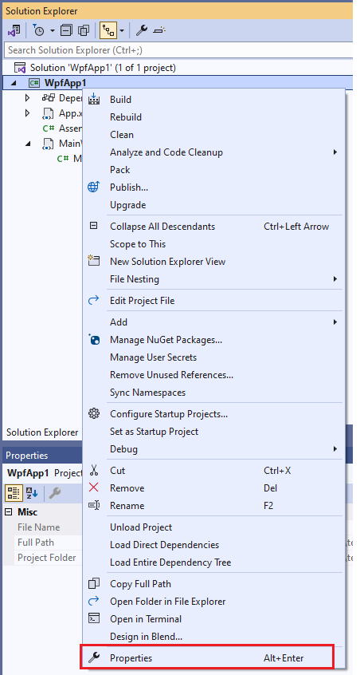
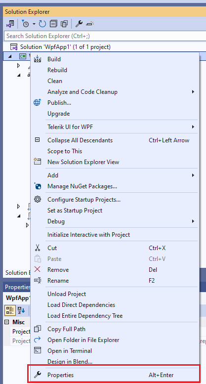

# Project Migration to .NET 4.6.2 and .{{ site.minimum_net_core_version }}

With the 2024 Q2 release (from May 2024), the Telerik UI for WPF product no longer provides support for __.NET Framework 4.0 and 4.5__, and also __.NET Core 3.1__. The minimum supported .NET Framework version is now __4.6.2__ and for .NET is {{ site.minimum_net_core_version }}.

This article describes how to migrate to a newer version of .NET.

> In case you are using .NET Framework, we recommend upgrading to .NET 8 or later in order to take advantage of the easier project maintenance and general .NET performance optimizations.

## Migrating from .NET Core 3.1 to .{{ site.minimum_net_core_version }}

There is no difference in the APIs between the different types of Telerik dlls, so you need to only change the `TargetFramework` setting of the project and the referenced Telerik dlls.

1. Download and install the corresponding [.NET developer pack](https://dotnet.microsoft.com/en-us/download/dotnet/8.0) (.{{ site.minimum_net_core_version }} or later).	
	
2. Right click on the WPF project in Visual Studio and select the __Properties__ option from the context menu.

	
	
3. In the __Target framework__ menu, select __.{{ site.minimum_net_core_version }}__ or later version and save the project file.

	
	
4. Update the referenced Telerik assemblies using the preferred installation approach. For example, via [NuGet]() or the [.msi installer]().

5. You may need to manually delete the __bin__ and __obj__ folders before rebuilding the project in order to ensure that any Visual Studio assemblies cache is cleared.

## Migrating from .NET Framework 4.0/4.5 to .{{ site.minimum_net_core_version }}

To migrate from .NET Framework to .NET, you can create a new .{{ site.minimum_net_core_version }} (or later) project and include the corresponding files from the .NET Framework project. Then, [install the Telerik .NET assemblies]() in the new project. This approach is described in more detail in the [Migrating to .NET]() article.

## Migrating from .NET Framework 4.0/4.5 to .NET Framework 4.6.2

There is no difference in the APIs between the different types of Telerik dlls, so you need to only change the __Target framework__ of the project and the referenced Telerik dlls.

1. Download and install the corresponding [.NET Framework developer pack](https://dotnet.microsoft.com/en-us/download/dotnet-framework/net462) (4.6.2 or later).	
	
2. Right click on the WPF project in Visual Studio and select the __Properties__ option from the context menu.

	
	
3. In the __Target framework__ menu, select __.NET Framework 4.6.2__ or later version and save the project file.

	
	
4. Update the referenced Telerik assemblies using the preferred installation approach. For example, via [NuGet]() or the [.msi installer]().

5. You may need to manually delete the __bin__ and __obj__ folders before rebuilding the project in order to ensure that any Visual Studio assemblies cache is cleared.

## See Also  
* [Overview of porting from .NET Framework to .NET](https://learn.microsoft.com/en-us/dotnet/core/porting/)
* [Migrate to .NET Framework 4.8, 4.7, and 4.6.2](https://learn.microsoft.com/en-us/dotnet/framework/migration-guide/)