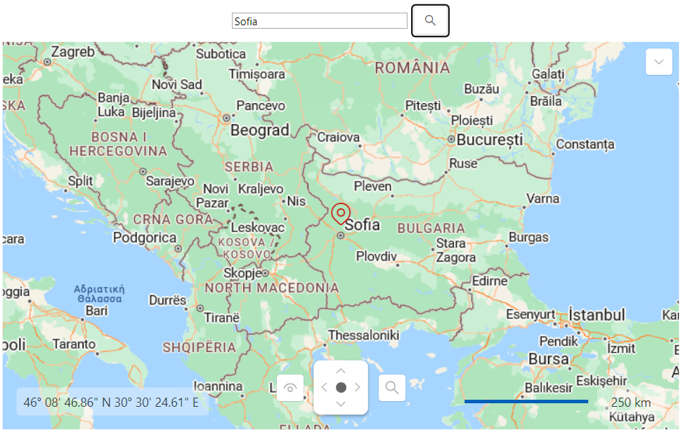

## Environment
<table>
	<tbody>
		<tr>
			<td>Product Version</td>
			<td>2025.1.211</td>
		</tr>
		<tr>
			<td>Product</td>
			<td>RadMap for WPF</td>
		</tr>
	</tbody>
</table>

## Description

Implementing geocoding (searching) functionality using the Azure Maps services.

## Solution

To achieve geocoding functionality using the Azure Maps services, you can create a new helper class. It will create a URL request for the Microsoft's geocoding API and use the response to center the RadMap control. In order to receive a valid response from the geocoding API, you will need to pass a valid location and subscription key to the request URL string.

#### __[C#] Implementing a helper class for retrieving the searched location__
{{region kb-map-azuremapprovider-geocoding-0}}
    internal class AzureGeocodingHelper
    {
        private static HttpClient httpClient = new HttpClient();

        internal async static Task<Location> GetGeoCode(string location)
        {
            //Modify this URL to match your Azure Mapss subscription key and location
            var requestUrl = $"https://atlas.microsoft.com/geocode?api-version=2025-01-01&query={location}&subscription-key={MyAzureMapsSubscriptionKey}";

            var response = await httpClient.GetAsync(requestUrl);
            response.EnsureSuccessStatusCode();

            var jsonContent = await response.Content.ReadAsStringAsync();
            var options = new JsonSerializerOptions
            {
                PropertyNamingPolicy = JsonNamingPolicy.CamelCase,
                PropertyNameCaseInsensitive = true
            };

            var featureCollection = JsonSerializer.Deserialize<FeatureCollection>(jsonContent, options);

            var firstCoordinates = featureCollection.Features.First().Geometry.Coordinates;
            return new Location(firstCoordinates[1], firstCoordinates[0]);
        }
    }

    public class FeatureCollection
    {
        public List<Feature> Features { get; set; }
    }

    public class Feature
    {
        public Geometry Geometry { get; set; }
    }

    public class Geometry
    {
        public List<double> Coordinates { get; set; }
    }
{{endregion}}

#### __[VB.NET] Implementing a helper class for retrieving the searched location__
{{region kb-map-azuremapprovider-geocoding-1}}
    Friend Class AzureGeocodingHelper
        Private Shared httpClient As HttpClient = New HttpClient()

        Friend Async Shared Function GetGeoCode(ByVal location As String) As Task(Of Location)
            Dim requestUrl = $"https://atlas.microsoft.com/geocode?api-version=2025-01-01&query={location}&subscription-key={MyAzureMapsSubscriptionKey}"
            Dim response = Await httpClient.GetAsync(requestUrl)
            response.EnsureSuccessStatusCode()
            Dim jsonContent = Await response.Content.ReadAsStringAsync()
            Dim options = New JsonSerializerOptions With {
                .PropertyNamingPolicy = JsonNamingPolicy.CamelCase,
                .PropertyNameCaseInsensitive = True
            }
            Dim featureCollection = JsonSerializer.Deserialize(Of FeatureCollection)(jsonContent, options)
            Dim firstCoordinates = featureCollection.Features.First().Geometry.Coordinates
            Return New Location(firstCoordinates(1), firstCoordinates(0))
        End Function
    End Class

    Public Class FeatureCollection
        Public Property Features As List(Of Feature)
    End Class

    Public Class Feature
        Public Property Geometry As Geometry
    End Class

    Public Class Geometry
        Public Property Coordinates As List(Of Double)
    End Class
{{endregion}}

Additionally, you can follow the next example, which showcases how to utilize the created `AzureGeocodingHelper` class and its `GetGeoCode` method.

#### __[XAML] Defining the RadMap and the UI elements for the geocoding logic__
{{region kb-map-azuremapprovider-geocoding-2}}
    <Grid>
        <Grid.Resources>
            <ResourceDictionary Source="/Telerik.Windows.Controls;component/Themes/FontResources.xaml"/>
        </Grid.Resources>
        <Grid.RowDefinitions>
            <RowDefinition Height="Auto"/>
            <RowDefinition Height="*"/>
        </Grid.RowDefinitions>
        <StackPanel Orientation="Horizontal" Margin="5" HorizontalAlignment="Center">
            <TextBox x:Name="textBoxSearchAddress" VerticalAlignment="Center" Width="200"/>
            <telerik:RadButton Click="RadButton_Click" VerticalAlignment="Center" Margin="4 0 0 0">
                <telerik:RadButton.Content>
                    <telerik:RadGlyph Glyph="{StaticResource GlyphZoom}"/>
                </telerik:RadButton.Content>
            </telerik:RadButton>
        </StackPanel>
        <telerik:RadMap x:Name="map" Grid.Row="1">
            <telerik:RadMap.Provider>
                <telerik:AzureMapProvider SubscriptionKey="Your Subscription Key"/>
            </telerik:RadMap.Provider>
            <telerik:VisualizationLayer x:Name="visualizationLayer"/>
        </telerik:RadMap>
    </Grid>
{{endregion}}

#### __[C#] Utilizing the AzureGeocodingHelper class's GetGeoCode method__
{{region kb-map-azuremapprovider-geocoding-3}}
    private async void RadButton_Click(object sender, RoutedEventArgs e)
    {
        try
        {
            Location location = await AzureGeocodingHelper.GetGeoCode(this.textBoxSearchAddress.Text);

            this.visualizationLayer.Items.Clear();
            this.visualizationLayer.Items.Add(location);
            this.map.Center = location;
        }
        catch (Exception exception)
        {
            MessageBox.Show("Please, enter a another location");
        }
    }
{{endregion}}

#### __[VB.NET] Utilizing the AzureGeocodingHelper class's GetGeoCode method__
{{region kb-map-azuremapprovider-geocoding-4}}
    Private Async Sub RadButton_Click(ByVal sender As Object, ByVal e As RoutedEventArgs)
        Try
            Dim location As Location = Await AzureGeocodingHelper.GetGeoCode(Me.textBoxSearchAddress.Text)
            Me.visualizationLayer.Items.Clear()
            Me.visualizationLayer.Items.Add(location)
            Me.map.Center = location
        Catch exception As Exception
            MessageBox.Show("Please, enter a another location")
        End Try
    End Sub
{{endregion}}

__RadMap with AzureMapProvider and geocoding functionality__

>tip For a more in-depth example of an Azure Maps services geocoding, check the __Geocoding__ demo from our [Demos application]().